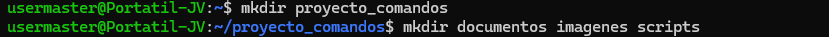
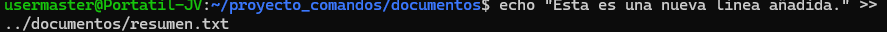

# Practica servidor web
## 1. Titulo
"Comandos de linux (creación y manipulación de archivos en linux)"

## 2. Tiempo de duración
45 minutos aproximadamente para desarrollar la práctica.

## 3. Fundamentos:
Linux es un sistema operativo basado en línea de comandos que permite interactuar directamente con el sistema mediante instrucciones llamadas comandos. A través de la terminal, los usuarios pueden realizar diversas tareas administrativas y de gestión sin necesidad de una interfaz gráfica. Entre los comandos más básicos están **pwd**, que muestra la ruta actual en el sistema de archivos, **ls**, que lista los archivos y directorios del directorio actual, y **cd**, que permite moverse entre carpetas. Para crear y gestionar archivos, se utilizan comandos como **touch** (para crear archivos vacíos), **mkdir** (para crear directorios), **cp** (para copiar archivos o directorios), **mv** (para mover o renombrar archivos) y **rm** (para eliminar archivos). Además, para ver el contenido de archivos, existen los comandos **cat**, **head**, **tail**, **more** y **less**, que permiten visualizar desde el contenido completo hasta las primeras o últimas líneas del archivo.

También es posible gestionar permisos y propietarios de archivos mediante **chmod** (para cambiar permisos) y **chown** (para cambiar el propietario de un archivo o directorio). El comando **ls -l** muestra los permisos actuales de los archivos, lo cual es útil para verificar si se tienen los permisos correctos. Para verificar quién está usando el sistema, el comando **whoami** muestra el nombre del usuario actual. Los usuarios pueden ejecutar tareas administrativas utilizando el comando **sudo**, que permite ejecutar comandos con privilegios de superusuario, esencial para tareas de instalación de software, configuración de hardware o modificaciones del sistema que requieren permisos elevados.

Además, la terminal de Linux puede combinarse con scripts para automatizar tareas repetitivas, lo que mejora la eficiencia en el trabajo. Estos comandos son esenciales para realizar operaciones básicas y tener un control más avanzado sobre el sistema, permitiendo gestionar archivos, configuraciones y el entorno del sistema de manera más eficiente. A medida que se adquiere experiencia, el manejo de estos comandos mejora la productividad y la comprensión del funcionamiento interno de Linux.

## 4. Conocimientos previos.
Para realizar esta practica el estudiante necesita tener claro los siguientes temas:
- Comandos linux.

## 5. Objetivos a alcanzar
- Crear una estructura de carpetas.
- Manipulación de archivos.
- Redirección y concatenación.
- Eliminación de archivos y carpetas.

## 6. Equipo necesario:
- Computador con sistema operativo Windows/Linux/Mac.

## 7. Material de apoyo.
- Documentacion sobre comandos en Linux.
- Video tutorial sobre comandos Linux.
  
## 8. Procedimiento
### Paso 1: Crear una estructura de carpetas.
- En tu directorio de trabajo, crea una carpeta llamada proyecto_comandos.
- Dentro de proyecto_comandos, crea tres subcarpetas: documentos, imagenes y scripts.

### Paso 2: Manipulación de archivos.
- Dentro de la carpeta documentos, crea un archivo de texto llamado notas.txt.
- Agrega al menos tres líneas de texto en notas.txt utilizando un editor de texto en la terminal (nano, vim) o con redireccionamiento (echo).
- Copia el archivo notas.txt a la carpeta scripts y cambia su nombre a backup_notas.txt.
- Mueve el archivo backup_notas.txt a la carpeta imágenes.

### Paso 3: Redirección y concatenación.
- Crea un archivo llamado resumen.txt en documentos.
- Redirecciona el contenido de notas.txt a resumen.txt.
- Añade una nueva línea de texto a resumen.txt sin sobrescribir su contenido.

### Paso 4: Eliminación de archivos y carpetas.
- Elimina el archivo backup_notas.txt de la carpeta imágenes.
- Elimina la carpeta imágenes (solo si está vacía).

### Paso 5: Entrega.
- Vuelca el contenido del comando history a un archivo llamado tarea-s1-nombre_apellido.txt utilizando tuberías.
- Sustituye "nombre_apellido" por tu nombre y apellido correspondiente.

## 9. Resultados esperados:
    
Efectivamente de los 5 pasos de la practica, todos se han cumplido y se pueden verificar con las capturas de pantalla ya seleccionadas.

## 10. Bibliografía
    
- Install WSL | Microsoft Learn. (n.d.). Retrieved April 4, 2025, from https://learn.microsoft.com/en-us/windows/wsl/install
- ¿Qué es Linux y para qué sirve? - Definición. (n.d.). Retrieved April 4, 2025, from https://www.geeknetic.es/Linux/que-es-y-para-que-sirve